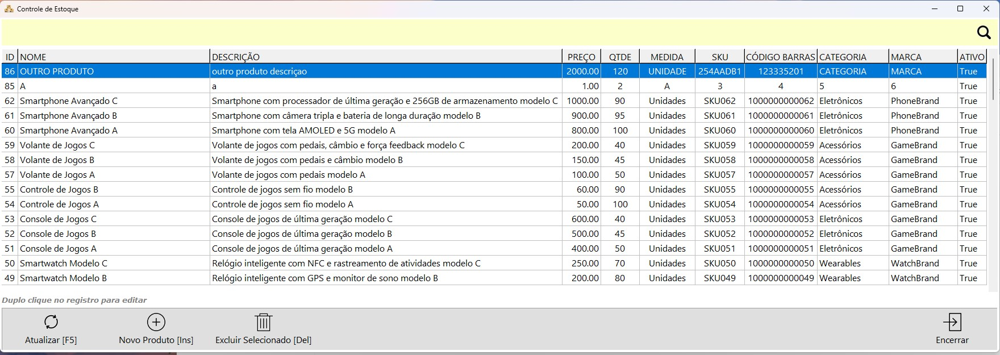

# Desenvolvimento Delphi - Controle de Produtos

Controle de Produtos é um sistema de gerenciamento de Produtos desenvolvido em Delphi 11, com um backend em PHP (API), utilizando o modelo MVC e banco de dados SQL Server.

## Funcionalidades

-   Criação, edição e exclusão de produtos.
-   Visualização dos produtos em uma lista.

## Tecnologias Utilizadas

-   PHP (Vanilla)
-   SQL Server
-   Delphi 11

## Pré-requisitos

-   Docker
-   Delphi 11

## Instalação

### Configuração em Servidor Local Apache

1. Clone o repositório:

    ```sh
    git clone https://github.com/marcelomileris/areco.git
    ```

2. Navegue até o diretório do projeto:

    ```sh
    cd areco
    ```

3. Configure o banco de dados no arquivo `config.php`.

4. Importe o arquivo SQL `script.sql` no seu banco de dados SQL Server.

5. Configure o servidor Apache para apontar para o diretório do projeto.

6. Edite o .htaccess e informe o nome do site como areco

7. Acesse o sistema via navegador:
    ```sh
    http://localhost/areco/api
    ```

### Utilizando Docker Compose

1. Clone o repositório:

    ```sh
    git clone https://github.com/marcelomileris/areco.git
    ```

2. Navegue até o diretório do projeto:

    ```sh
    cd areco
    ```

3. Execute o Docker Compose:

    ```sh
    docker-compose up -d
    ```

4. Acesse o sistema via navegador:
    ```sh
    http://localhost:8080/api
    ```

## Uso

Após o backend estar sendo executado no Docker, abra o projeto no Delphi e execute.

## Capturas de Tela

### Tela Principal

![Tela Principal]
<br>

